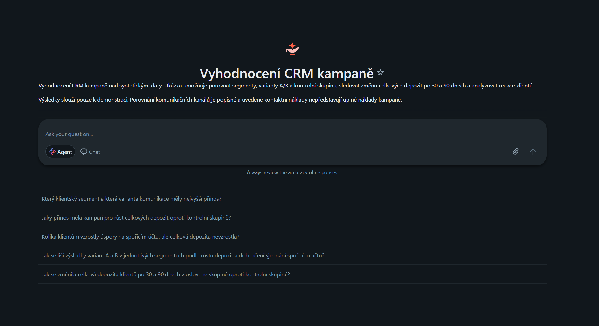
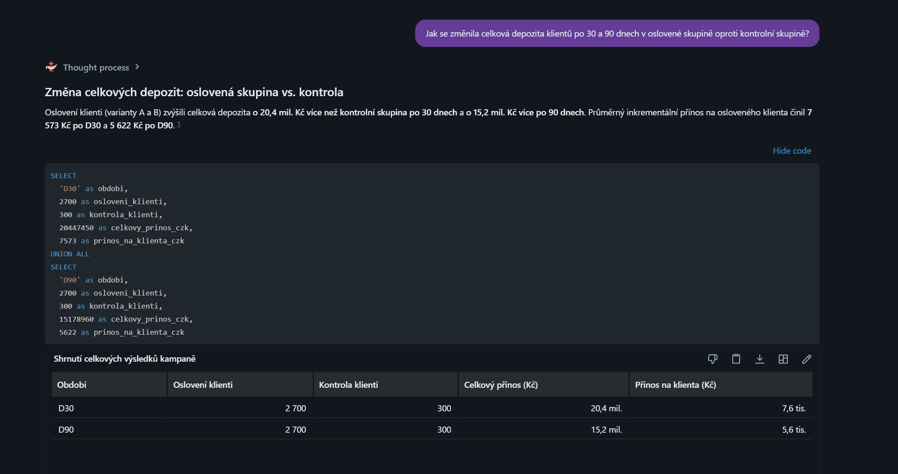
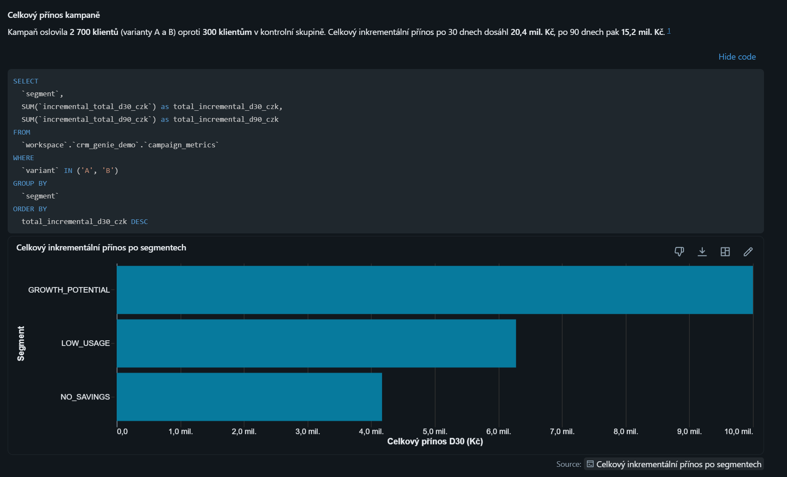
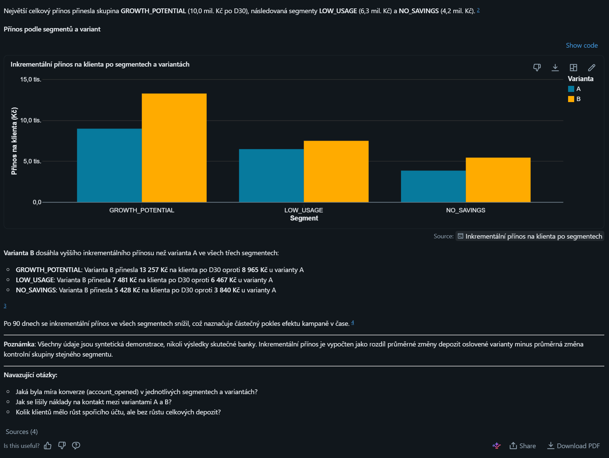

# Analýza CRM kampaní v Databricks Genie

Praktická ukázka využití Databricks AI/BI Genie pro dotazování nad výsledky CRM kampaní v přirozeném jazyce.

Projekt propojuje přípravu dat, definici obchodních metrik a nastavení Genie, který na otázky v češtině odpovídá pomocí SQL, tabulek a grafů.

## Ukázkový scénář

Ukázkový scénář se zaměřuje na vyhodnocení depozitní kampaně. Pracuje se syntetickými daty a umožňuje:

- porovnávat klientské segmenty a varianty A/B,
- porovnávat oslovené klienty s kontrolní skupinou,
- sledovat změnu celkových depozit po 30 a 90 dnech,
- analyzovat reakce klientů a dokončení sjednání.

Hlavní obchodní metrikou je změna celkových depozit klienta
u banky. Samotný přesun peněz z běžného na spořicí účet
nepředstavuje růst celkových depozit.

## Příklady otázek pro Genie

- Jak se změnila celková depozita klientů po 30 a 90 dnech
  v oslovené skupině oproti kontrolní skupině?
- Jak se liší výsledky variant A a B v jednotlivých segmentech
  podle růstu depozit a dokončení sjednání spořicího účtu?
- Jaké reakce klientů následovaly po oslovení v jednotlivých
  komunikačních kanálech?

## Ukázka prostředí

## Ukázka analýzy

**Otázka:** Jak se změnila celková depozita klientů po 30 a 90 dnech
v oslovené skupině oproti kontrolní skupině?

## Interpretace výsledků

Veškerá data jsou syntetická a výsledky slouží pouze
k demonstraci řešení.

Porovnání komunikačních kanálů je popisné a samo o sobě
neprokazuje jejich kauzální vliv. Uvedené kontaktní náklady
nepředstavují úplné náklady kampaně.

## Dostupnost živé ukázky

Chat běží v prostředí Databricks a vyžaduje odpovídající
přístupová oprávnění. Tento repozitář slouží k dokumentaci
řešení; samotné zveřejnění na GitHubu nezpřístupňuje živý chat.

## Notebook

Složka [notebooks](notebooks/) obsahuje notebook použitý
pro přípravu syntetických dat v Databricks.

Výchozí notebook jsem spustila v Databricks, provedla dílčí úpravy a nakonfigurovala
Genie včetně popisu a doporučených otázek.
